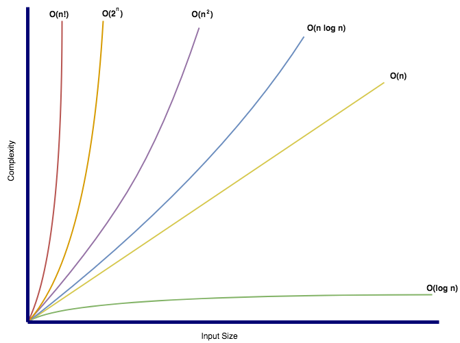

import { DividerTitle } from "../../components/divider";

The Big O notation, also called Bachmann-Landau notation, **is a relative**
**representation of the complexity of an algorithm**.

It is used for comparing algorithms according to how their run time or space
requirements grow as the input size grows. Big O always assumes the worst-case.
Regardless of the hardware, O(1) is always going to complete faster than O(n!).

<DividerTitle as="h4" variant="styles.h5">
  List
</DividerTitle>

| Data structure         | Access | Prepend | Insert | Append                   | Delete | Search | Traverse |
| ---------------------- | ------ | ------- | ------ | ------------------------ | ------ | ------ | -------- |
| `ArrayList`            | O(1)   | O(n)    | O(n)   | O(1) / O(n)\* | O(n)   | O(n)   | O(n)     |
| `LinkedList`           | O(n/2) | O(1)    | O(n)   | O(1)                     | O(n)   | O(n)   | O(n)     |
| `CopyOnWriteArrayList` | O(1)   | O(2n)   | O(2n)  | O(n)                     | O(2n)  | O(n)   | O(n)     |

* when resizing is needed

<DividerTitle as="h4" variant="styles.h5">
  Queue
</DividerTitle>

| Data structure          | Peek | Offer                    | Poll      | Size |
| ----------------------- | ---- | ------------------------ | --------- | ---- |
| `LinkedList`            | O(1) | O(1)                     | O(1)      | O(1) |
| `PriorityQueue`         | O(1) | O(log(n))                | O(log(n)) | O(1) |
| `ArrayDeque`            | O(1) | O(1) / O(n)\* | O(1)      | O(1) |
| `ConcurrentLinkedQueue` | O(1) | O(1)                     | O(1)      | O(n) |
| `ArrayBlockingQueue`    | O(1) | O(1)                     | O(1)      | O(1) |

* when resizing is needed

<DividerTitle as="h4" variant="styles.h5">
  Map
</DividerTitle>

| Data structure  | Access    | Insert                   | Delete    | Next                  | Search                |
| --------------- | --------- | ------------------------ | --------- | --------------------- | --------------------- |
| `HashMap`       | O(1)      | O(1) / O(n)\* | O(1)      | O(c/n)\*\* | O(c+n)\*\* |
| `LinkedHashMap` | O(1)      | O(1) / O(n)\* | O(1)      | O(1)                  | O(n)                  |
| `TreeMap`       | O(log(n)) | O(log(n))                | O(log(n)) | O(log(n))             | O(log(n)              |

* when resizing is needed  
** c is the table capacity

<DividerTitle as="h4" variant="styles.h5">
  Set
</DividerTitle>

| Data structure  | Insert                   | Delete    | Next                  | Search                | Traverse              |
| --------------- | ------------------------ | --------- | --------------------- | --------------------- | --------------------- |
| `HashSet`       | O(1) / O(n)\* | O(1)      | O(c/n)\*\* | O(c+n)\*\* | O(c+n)\*\* |
| `LinkedHashSet` | O(1) / O(n)\* | O(1)      | O(1)                  | O(n)                  | O(n)                  |
| `TreeSet`       | O(log(n))                | O(log(n)) | O(log(n))             | O(log(n))             | O(n)                  |

* when resizing is needed  
** c is the table capacity
